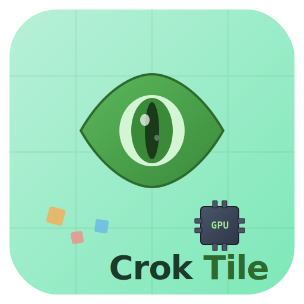

<!-- _class: lead -->

# CrokTile

### Easy GPU Programming with Zero-Cost Abstractions



---

## What is CrokTile?

A **high-level GPU programming framework** that makes CUDA kernel development accessible without sacrificing performance.

<!-- _class: split -->

**Easy to Use**
40% of equivalent CUDA code.
Higher abstraction than Triton.

**Compile-Time Safety**
Catch tiling bugs before they crash your GPU. Best-in-class static checks.

**Dynamic / Symbolic Shapes**
First system with dynamic shared memory in low-level kernels.

**Born for AI Agents**
Engineered for agentic AI programming with superior context & harness.

---

<!-- _class: chapter -->

#### Chapter 1

## Easy to Use

Best of all competitors: Triton / CuTe / Cutile / Helion

---

<!-- _class: split -->

## Less Code: 40% of Equivalent CUDA

**CrokTile — matmul kernel (25 LOC)**

```
__co__ void matmul(
    global f16 [M, K] lhs,
    global f16 [N, K] rhs,
    global f16 [M, N] output) {

  parallel {block_m, block_n}
    by [cdiv(M, WARP_M), cdiv(N, WARP_N)]
    : block {
    shared f16 [WARP_M, TILE_K] lhs_s;
    shared f16 [WARP_N, TILE_K] rhs_s;
    mc = mma.fill.f16 0.0f;
    foreach {iv_k} in [cdiv(K, TILE_K)] {
      tma.copy.swiz<128>
        lhs.chunkat(block_m, iv_k) => lhs_s;
      tma.copy.swiz<128>
        rhs.chunkat(block_n, iv_k) => rhs_s;
      foreach {iv} in [cdiv(TILE_K, WARP_K)] {
        parallel p by 1 : group-4 {
          ma = mma.load.swiz<128>
                 lhs_s.chunkat(_, iv);
          mb = mma.load.swiz<128>
                 rhs_s.chunkat(_, iv);
          mma.row.row mc, ma, mb;
        }
      }
    }
    mma.store mc, output.chunkat(block_m,
                                 block_n);
  }
}
```

**Generated CUDA/CuTe — same kernel (180+ LOC)**

```
__global__ void __choreo_device_matmul(
    f16* lhs, f16* rhs, f16* output,
    unsigned K, unsigned M, unsigned N,
    const __grid_constant__
      CUtensorMap __choreo_tma_0_tensor_map,
    const __grid_constant__
      CUtensorMap __choreo_tma_1_tensor_map,
    const __grid_constant__
      CUtensorMap __choreo_tma_2_tensor_map) {
  auto wg_barrier =
    cooperative_groups::tiled_partition<128>(
      cooperative_groups::this_thread_block());
  __shared__ cuda::barrier<
    cuda::thread_scope_block>
      choreo_copy_atom_t_0_barrier;
  if (__CHOREO_BLOCK_SINGLE__) {
    init(&choreo_copy_atom_t_0_barrier,
         blockDim.x);
    cde::fence_proxy_async_shared_cta();
  }
  __syncthreads();
  // ... TMA barrier setup x3 ...
  // ... shared memory allocation ...
  // ... fragment initialization ...
  // ... TMA load orchestration ...
  // ... WGMMA descriptor creation ...
  // ... warpgroup synchronization ...
  // ... 180+ lines total ...
}
```

---

<!-- _class: split -->

## Work on Tensors, Not Buffers

**CrokTile — typed tensor parameters**

Tensors carry shape, data type, and memory space as part of the declaration. No manual pointer arithmetic.

```
// Dense GEMM: 2D tensors with named dims
__co__ void matmul(
    global f16 [M, K] lhs,
    global f16 [N, K] rhs,
    global f16 [M, N] output)

// BMM: 3D batched tensors
__co__ void bmm(
    global bf16 [B, M, K] lhs,
    global bf16 [B, N, K] rhs,
    global f32  [B, M, N] output)

// Shared memory: typed + shaped
shared f16 [WARP_M, TILE_K] lhs_s;
```

**CUDA — raw pointers + manual offsets**

All shape information is implicit. Buffer boundaries must be tracked manually. Off-by-one bugs are silent.

```
__global__ void matmul(
    f16* lhs, f16* rhs, f16* output,
    unsigned K, unsigned M, unsigned N,
    const __grid_constant__
      CUtensorMap tma_0, ...)
{
  // manual shared memory allocation
  __shared__ alignas(1024)
    unsigned char anon_1[24576];
  f16* lhs_s = (f16*)(anon_1 + 16384);
  f16* rhs_s = (f16*)(anon_1 + 0);

  // manual offset arithmetic
  output[row * N + col] = ...;
}
```

---

<!-- _class: split -->

## No Manual TMA/DMA Management

**CrokTile — one-liner TMA copy**

TMA (Tensor Memory Accelerator) loads are a single instruction. Shape, swizzle, and async barriers are handled automatically.

```
// TMA load: global → shared (1 line)
tma.copy.swiz<128>
  lhs.chunkat(block_m, iv_k) => lhs_s;

// TMA store: shared → global (1 line)
tma.copy output_s =>
  output.subspan(WARP_M, WARP_N)
        .at(block_m, block_n);

// DMA load: global → shared (1 line)
lhs_s = dma.copy
  lhs.chunkat(block_m, iv_k) => shared;
```

**CUDA — TMA descriptor setup (30+ LOC)**

```
// TMA requires manual descriptor creation
uint64_t tma_shape[] = {K, M};
uint64_t tma_strides[] = {(K * 2)};
uint32_t tma_box[] = {64, 64};
uint32_t tma_elem_strides[] = {1, 1};
alignas(64) CUtensorMap tma_map{};
cuTensorMapEncodeTiled(
  &tma_map,
  CU_TENSOR_MAP_DATA_TYPE_FLOAT16,
  2, lhs.data(),
  tma_shape, tma_strides,
  tma_box, tma_elem_strides,
  CU_TENSOR_MAP_INTERLEAVE_NONE,
  CU_TENSOR_MAP_SWIZZLE_128B,
  CU_TENSOR_MAP_L2_PROMOTION_NONE,
  CU_TENSOR_MAP_FLOAT_OOB_FILL_NONE);
// ... repeat for each tensor ...
// ... then barrier setup ...
// ... then async copy orchestration ...
```

---

<!-- _class: codeblock -->

## Parallel Programs Made Simple

CrokTile expresses GPU parallelism **declaratively** — from thread blocks to warp groups to individual threads. No manual `blockIdx`, `threadIdx`, or `__syncthreads()`.

```
// Level 1: Block-level parallelism (GEMM)
parallel {block_m, block_n} by [cdiv(M, WARP_M), cdiv(N, WARP_N)] : block { ... }

// Level 2: Warp-group parallelism (128 threads = 4 warps)
parallel p by 1 : group-4 { ... }

// Level 3: Thread-level parallelism (BMM accumulation)
parallel {m, n} by [WARP_M, 2] : thread { ... }

// Level 4: Expert-parallel async blocks (MoE GEMM)
parallel.async {eid, block_n} by [EXPERTS, cdiv(N, WARP_N)] : block

// Level 5: Warp-specialized producer/consumer (blockscale GEMM)
parallel p1 by 2 : group-4 {
    inthreads.async (p1 == 0) { /* TMA producer */ }
    inthreads.async (p1 == 1) { /* WGMMA consumer */ }
}
```

> In CUDA, each of these patterns requires hundreds of lines of barrier management, index calculations, and synchronization primitives.

---

## Best Practices Enforced by Tileflow

Every CrokTile kernel follows the **same canonical pipeline** — the language ensures you can't skip steps or misorder operations.

```
__co__ void kernel(global f16 [M, K] lhs, ...) {
  // 1. PARTITION — declare parallel tile decomposition
  parallel {block_m, block_n} by [...] : block {

    // 2. ALLOCATE — typed shared memory tiles
    shared f16 [WARP_M, TILE_K] tile_s;

    // 3. INITIALIZE — accumulator setup
    mc = mma.fill.f16 0.0f;

    // 4. ITERATE — tile over reduction dimension
    foreach {iv_k} in [cdiv(K, TILE_K)] {

      // 5. LOAD — tma/dma copy global → shared
      tma.copy.swiz<128> lhs.chunkat(...) => tile_s;

      // 6. COMPUTE — MMA on warp group
      parallel p by 1 : group-4 {
        ma = mma.load.swiz<128> tile_s.chunkat(...);
        mma.row.row mc, ma, mb;
      }
    }
    // 7. STORE — accumulator → shared → global
    mma.store mc, output_s;
    tma.copy output_s => output.subspan(...).at(...);
  }
}
```

---

## C++ Integration — Works with CUTLASS/CuTe

CrokTile kernels live alongside standard C++ code. The host API uses familiar C++ patterns — no FFI, no bindings, no serialization.

```cpp
// Host code: allocate typed tensors (C++ standard library style)
auto lhs_h = choreo::make_spandata<choreo::f16>(M, K);
auto rhs_h = choreo::make_spandata<choreo::f16>(N, K);
lhs_h.fill_random(0, 2);

// Create device views (zero-copy span wrappers)
auto lhs_d = choreo::make_spanview<choreo::f16, 2>(a_d, {M, K});
auto rhs_d = choreo::make_spanview<choreo::f16, 2>(b_d, {N, K});

// Call __co__ kernel like any C++ function
matmul(lhs_d, rhs_d, res_d);

// Built-in profiling
choreo::TimerOption topt{.warmup = 10, .repeat = 500};
auto avg_ms = choreo::timing(
    [&]() { matmul(lhs_d, rhs_d, res_d); cudaDeviceSynchronize(); },
    topt);
std::cout << "TFLOPS: " << (2.0*M*N*K / (avg_ms/1e3)) / 1e12 << "\n";
```

> CrokTile compiles to CUDA/CuTe via `choreo -gs -t cute -arch=sm_90a`, producing standard `.cu` files that work with `nvcc` and CUTLASS.

---

<!-- _class: chapter -->

#### Chapter 2

## Compile-Time Code Safety

Best of all competitors: Triton / CuTe / Cutile / Helion

---

<!-- _class: split -->

## Tiling Mismatch Detection at Compile Time

**CrokTile — catches misconfigurations before GPU execution**

From real production kernels — these constraints are enforced by the compiler, not discovered after hours of debugging:

```
// matmul_f16_dyn_sm90.co
#if MATMUL_SWIZ != (2 * MATMUL_TILE_K)
#error "MATMUL_SWIZ must equal 2 * MATMUL_TILE_K
        for f16 kernel"
#endif

#if MATMUL_SWIZ != 32 && MATMUL_SWIZ != 64 \
    && MATMUL_SWIZ != 128
#error "MATMUL_SWIZ must be one of 32, 64, 128"
#endif

#if MATMUL_WARP_M != 64
#error "MATMUL_WARP_M must be 64 for f16
        WGMMA constraints"
#endif

#if MATMUL_WARP_K != 16
#error "MATMUL_WARP_K must be 16 for f16
        WGMMA constraints"
#endif
```

**In CUDA/CuTe — these are silent bugs**

Wrong tiling parameters in CUDA don't cause compile errors. They produce:

- Silent data corruption
- Intermittent wrong results
- GPU hangs with no diagnostic
- Performance cliffs with no explanation

> "The bug that takes 5 days to find in CUDA is a compile error in CrokTile."

---

## Runtime Checks — The Full Safety Net

CrokTile provides **two layers of protection**: compile-time tiling checks AND auto-generated runtime validation.

**Layer 1: Compile-Time** (covered previously)
```
#error "MATMUL_WARP_M must be 64 for f16 WGMMA constraints"
#error "MATMUL_SWIZ must equal 2 * MATMUL_TILE_K for f16 kernel"
```

**Layer 2: Auto-Generated Runtime Checks** (from generated CuTe output)
```cpp
// Automatically generated shape consistency checks
choreo::runtime_check(lhs.shape()[1] == rhs.shape()[1],
    "The shapes of the 1st parameter (dim: 1) and the 2nd parameter (dim: 1) "
    "are inconsistent.");
choreo::runtime_check(lhs.shape()[0] == output.shape()[0],
    "The shapes of the 1st parameter (dim: 0) and the 3rd parameter (dim: 0) "
    "are inconsistent.");
choreo::runtime_check(rhs.shape()[0] == output.shape()[1],
    "The shapes of the 2nd parameter (dim: 0) and the 3rd parameter (dim: 1) "
    "are inconsistent.");
```

> No other GPU programming framework generates both layers automatically. In Triton or CUDA, shape mismatches produce silent wrong results.

---

<!-- _class: chapter -->

#### Chapter 3

## Dynamic / Symbolic Shape Support

First of its kind — best of all competitors

---

<!-- _class: split -->

## Dynamic vs Static Shapes

**Static shapes — fixed at compile time**

Dimensions are `#define` constants. Every new size requires recompilation. Shared memory is fixed.

```
#define M 4096
#define N 2048
#define K 2048

__co__ auto matmul(
    f16 [M, K] lhs,
    f16 [N, K] rhs) {
  f16 [M, N] output{0.0f};
  int TILE_M = 32, TILE_N = 32;
  // ...
}
```

**Dynamic shapes — resolved at runtime**

Dimensions are **symbolic parameters**. One compilation serves all sizes. Shared memory adapts automatically.

```
__co__ void matmul(
    global f16 [M, K] lhs,
    global f16 [N, K] rhs,
    global f16 [M, N] output) {
  // M, N, K are runtime values
  parallel {block_m, block_n}
    by [cdiv(M, WARP_M), cdiv(N, WARP_N)]
    : block {
    shared f16 [WARP_M, TILE_K] lhs_s;
    // shared memory size adapts to tiles
    // ...
  }
}
// Called with any M, N, K at runtime:
// matmul(lhs_2048, rhs_2048, res_2048);
// matmul(lhs_4096, rhs_8192, res_4096);
```

---

<!-- _class: codeblock -->

## Flexible Memory Access Primitives

CrokTile provides a rich set of **view and slicing operators** that work on both static and dynamic tensors — all bounds-checked and type-safe.

```
// chunkat — tile a tensor into fixed-size chunks, index by tile coordinate
lhs_load_s = tma.copy.swiz<128> lhs.chunkat(block_m, iv_k) => shared;

// subspan — create a sub-view with explicit tile shape
tma.copy output_s => output.subspan(WARP_M, WARP_N).at(block_m, block_n);

// view + from — dynamic window into a tensor (MoE expert segments)
dma.copy.swiz<128>.zfill
  lhs.view(WARP_M, TILE_K).from(seg_start + iv_m * WARP_M, iv_k * TILE_K)
    => sA.subspan(TILE_M, TILE_K);

// span_as — reshape without copy (BMM: collapse batch dim)
ma = mma.load.swizzle<128>
  lhs_load_s.span_as([WARP_M, TILE_SIZE_K]).chunkat(_, iv_warp);

// at — scalar element access
output.at(block_b, block_m # m, block_n # (n # ni)) += result;

// # operator — hierarchical index composition (block + warp + thread)
block_m # iv_warp_m # iv_thr_m # thr_m   // composes to a global index
```

> In CUDA, each of these requires manual pointer arithmetic with error-prone offset calculations.

---

<!-- _class: chapter -->

#### Chapter 4

## Born for Agentic AI Programming

Superior context engineering + superior harness engineering

---

## Superior Context Engineering — Real Results

**1 AI agent + 1 CrokTile request = autonomous performance tuning**

The Choreo project used AI agents to autonomously optimize GPU kernels over multiple sessions, achieving results that surpass SOTA operator libraries.

| Kernel | Iterations | Baseline | Best | vs Baseline | vs cuBLAS |
|--------|-----------|----------|------|-------------|-----------|
| Dense GEMM FP16 | 65 | 208.7 TFLOPS | 382.5 TFLOPS | **+83%** | **100.5%** |
| Sparse GEMM FP16 | 153 | 368 TFLOPS | 655 TFLOPS | **+78%** | — |
| Blockscale GEMM FP8 | 71 | 397.9 TFLOPS | 621 TFLOPS | **+56%** | — |

**Why CrokTile enables this:**
- **25-line kernels** fit entirely in an AI agent's context window (~500 tokens)
- Clean syntax is parsable — AI agents **understand** the code, not just copy it
- Tileflow structure guides the agent to make **valid** optimizations
- Each iteration is a small, safe change within the compile-time safety net

> The same optimization task in CUDA would require 180+ lines per kernel, 3000+ tokens of context, and manual debugging of silent bugs.

---

## Superior Harness Engineering — Compiler as AI Guardrail

CrokTile's compiler messages are **tailored for AI understanding** — guiding program repair and performance tuning with minimal random guessing.

**Compile-time messages tell the AI agent exactly what to fix:**

```
error: "MATMUL_WARP_M must be 64 for f16 WGMMA constraints"
error: "MATMUL_SWIZ must equal 2 * MATMUL_TILE_K for f16 kernel"
error: "MATMUL_WARP_K must be 32 for f8 WGMMA constraints"
```

**Runtime checks validate shapes with actionable diagnostics:**

```
runtime_check failed: "The shapes of the 1st parameter (dim: 1)
  and the 2nd parameter (dim: 1) are inconsistent."
```

**Result: 200+ iterations without a single silent failure**

| Metric | CrokTile | CUDA |
|--------|----------|------|
| Invalid kernel → compile error | **Yes** | No (silent bug) |
| Shape mismatch → runtime error | **Auto-generated** | Manual or absent |
| AI agent iterations without crash | **200+** | Frequent hangs |
| Context cost per debug cycle | **~0 tokens** (compiler tells why) | **~3000+ tokens** (need full trace) |
| AI learning curve | **Hours** (structured syntax) | **Days** (tribal knowledge) |

> The compiler is the harness — it reduces AI randomness by making invalid programs **impossible to compile**.

---

<!-- _class: lead -->

# CrokTile

### Fewer Lines. Safer Kernels. AI-Ready.

**40%** of equivalent CUDA code
**83%** faster than baseline (AI-tuned)
**200+** autonomous AI iterations without failure
**100.5%** cuBLAS performance on dense GEMM


github.com/croktile
